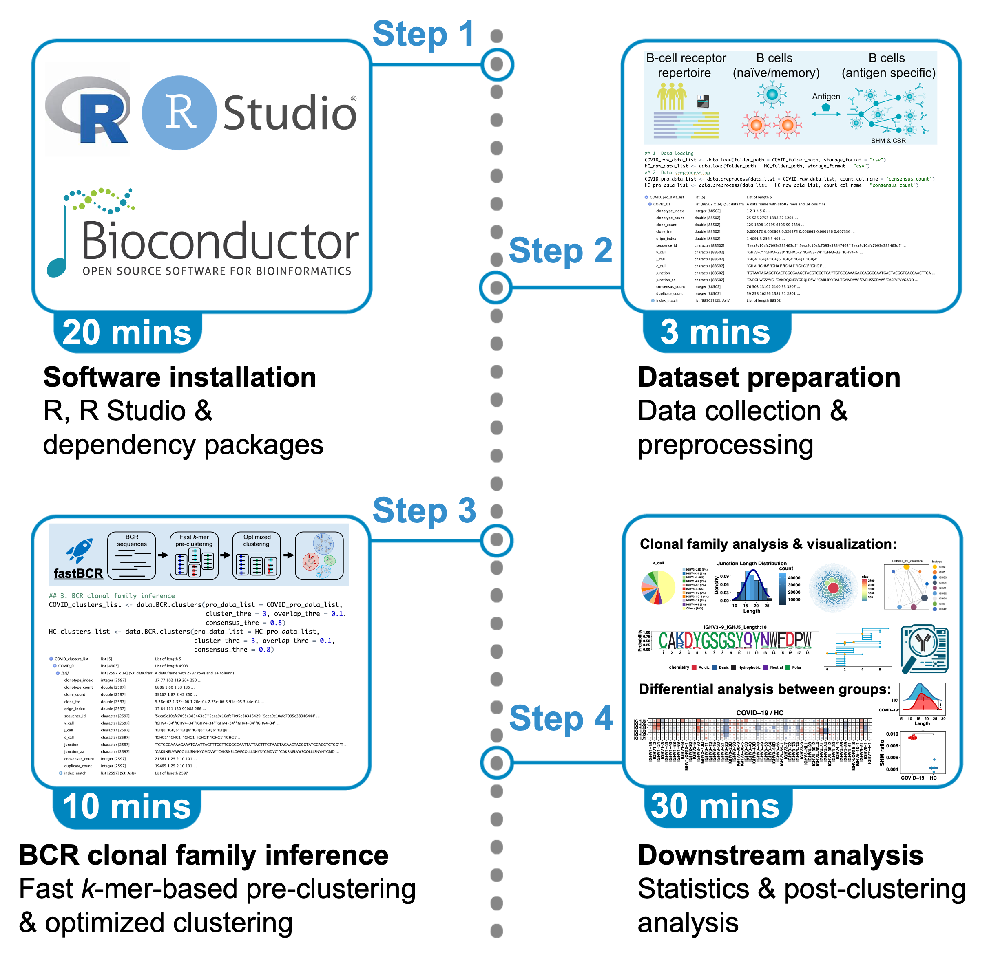

# fastBCR

### A heuristic method for fast BCR clonal family inference from large-scale AIRR-seq data

<!-- badges: start -->
<!-- badges: end -->

## Update Notes

**Date:** January 2025  
**Version:** 1.2.0  

**New Features:**
- **Integration with fastBCR-p**  
  `fastBCR-p` is an improved algorithm built on top of fastBCR, specifically designed for **paired BCR data**. It includes the following features:
  - Integrating light-chain refinements into heavy-chain clustering  to optimize clonal family inference.
  - Supports public antibody prediction and filtering:
    - Binary classification for heavy chain antibodies (`public VH`).
    - Regression prediction for light chain antibodies (`public VL`).

- **Added the `paired` parameter to select heavy clustering or paired clustering**  
  A new `paired` parameter has been introduced (default is `FALSE`). When set to `TRUE`, the enhanced algorithm **fastBCR-p** is activated, enabling optimized clustering for paired-chain BCR sequencing datasets. This feature significantly improves clustering accuracy for paired-chain data.

- **Backward Compatibility**  
  Existing functions remain unaffected, ensuring seamless integration without disrupting current workflows.
x1
**For detailed documentation and usage guidelines on fastBCR-p**, please refer to the [fastBCR-p README](https://github.com/ZhangLabTJU/fastBCR/blob/main/example/example_paired/README.md). It includes installation instructions, configuration details, example datasets, and output explanations.


## Overview


Recent advancements in high-throughput sequencing technologies have significantly enhanced our ability to characterize B cell receptor (BCR) repertoires on a large scale. However, the sheer volume and extensive diversity of BCR sequences present formidable challenges for efficient and biologically meaningful analysis. FastBCR emerges as a efficient computational approach tailored for inferring B cell clonal families from massive datasets of BCR heavy chain sequences. In addition to its clustering capabilities, the FastBCR package offers a suite of functional modules designed to streamline post-clustering analysis. These modules encompass diverse functionalities such as diversity analysis, statistics on V/J gene usage, distribution of conserved motifs, construction of phylogenetic trees, and analysis of affinity maturation, including assessments of [somatic hypermutation (SHM) and class switch recombination (CSR)]. Furthermore, FastBCR facilitates the querying of neutralizing antibodies (NAbs), enriching its utility for BCR repertoire analysis and antibody discovery endeavors.

<div align=center>

</div>

## License

We have updated the License to Attribution-NonCommercial-ShareAlike 4.0 International (CC BY-NC-SA 4.0) (see [License file](https://creativecommons.org/licenses/by-nc-sa/4.0/legalcode.zh-hans)).


### REFERENCE
Wang, K., Cai, L., Wang, H., Shan, S., and Zhang, J. (2024). **Protocol for fast clonal family inference and analysis from large-scale B cell receptor repertoire sequencing data.** STAR Protocols, https://doi.org/10.1016/j.xpro.2024.102969.

Wang, K., Hu, X., and Zhang, J. (2023). **Fast clonal family inference from large-scale B cell repertoire sequencing data.** Cell Rep Methods, https://doi.org/10.1016/j.crmeth.2023.100601.

## Installation

Before installing fastBCR, you need to download the dependency packages
'proj4', 'msa', 'ggtree' and 'ggmsa' using Bioconductor. To install these packages, 
start R (version >= 4.1.0) and enter:

``` r
if (!require("BiocManager", quietly = TRUE))
    install.packages("BiocManager")

BiocManager::install(c("proj4","msa","ggtree","ggmsa"))
```

Now you can install fastBCR like so:

``` r
if(!require(devtools)){
  install.packages("devtools")
}
devtools::install_github("ZhangLabTJU/fastBCR")
```

## Usage

### Example pipeline

The following outlines an R-based computational pipeline meticulously crafted for the efficient analysis of bulk BCR repertoire heavy chain sequencing data. This pipeline leverages the capabilities of fastBCR, an automated algorithm specialized in rapid clonal family inference, augmented by a suite of indispensable modules for downstream analyses.

Pipeline Components

**1. BCR Clonal Family Inference:**

Utilizing fastBCR, this step efficiently identifies and categorizes B cell clonal families within the sequencing dataset.

**2. Downstream Analysis:**

1) *V/J Gene Usage Statistics:* Provides insights into the usage patterns of V and J genes within the identified clonal families.

2) *Distribution of Conserved Motifs:* Analyzes the prevalence and distribution of conserved motifs across the BCR sequences.

3) *Construction of Phylogenetic Trees:* Generates phylogenetic trees to elucidate evolutionary relationships among B cell clonal families.

4) *Analysis of Affinity Maturation:* Evaluates somatic hypermutation (SHM) and class switch recombination (CSR) events to assess affinity maturation.

5) *Diversity Assessment:* Quantifies the diversity of the BCR repertoire, aiding in the understanding of immune system dynamics.

6) *Neutralizing Antibody (NAb) Query:* Facilitates the identification and analysis of neutralizing antibodies within the dataset.

You can follow the **'fastBCR_pipeline.Rmd'** 
in **'/example'** folder to run the pipeline example. 

<div align=center>

</div>

### Example datasets

Ten real example AIRR Rearrangement datasets are included in
the fastBCR package in the 'example' folder. The datasets consist of BCR 
sequencing data from peripheral blood samples of five COVID-19 patients
(Galson et al., 2020) and five healthy donors (Ghraichy et al., 2020).
To infer clonal families successfully, the dataset should include essential columns:
``` r
# Required
## "v_call" (V gene with or without allele)
## "j_call" (J gene with or without allele)
## "junction_aa" (amino acid translation of the junction)

# Optional
## "junction" (junction region nucleotide sequence, where the junction is defined as the CDR3 plus the two flanking conserved codons. Needed for phylogenetic tree construction.)
## "c_call" (constant region gene with or without allele. Needed for isotypes related analyis.)
```

### Clonal Family Simulation

In addition, fastBCR can be combined with annotation software (_e.g._ IgBlast) 
for B-cell **Clonal Family Simulation**. 

fastBCR can simulate the generation of B cell clonal families to evaluate the 
performance of different clonal family inference methods. Specifically, it 
begins by generating an ancestor cell through V(D)J random recombinant and 
simulated the process of antigen activation that led to multiple rounds of 
expansion, mutation in the junction region and elimination, ultimately 
resulting in the formation of a B cell clonal family. This process needs to be 
combined with sequence annotation software, and here we recommend using IgBlast.
(URL: https://changeo.readthedocs.io/en/stable/examples/igblast.html)

<div align=center>

</div>


``` r
germline2fas(gemline_num = 100, filename = "Simulation/Germline.fasta")
# Annotation
germline_data = read.table('Simulation/Germline_igblast_db-pass_parse-select.tsv', header = T, sep = "\t")
CF2fas(germline_data, CF_n = 10, mut_ratio = 0.001, filename = 'Simulation/10_0.001.fasta')
# Annotation
```
