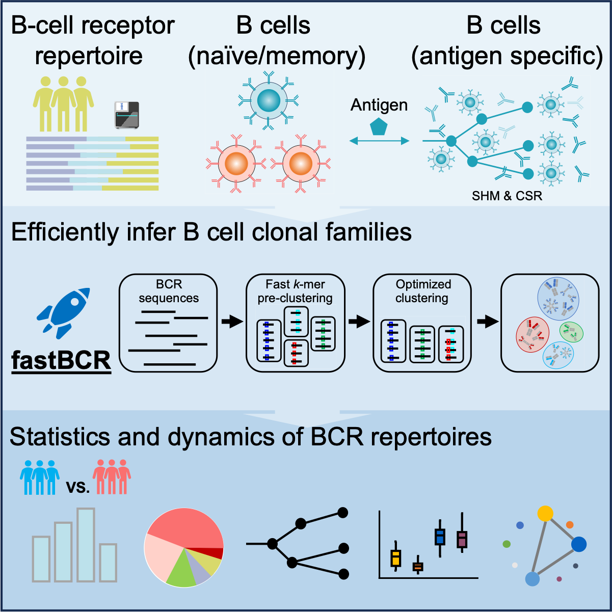
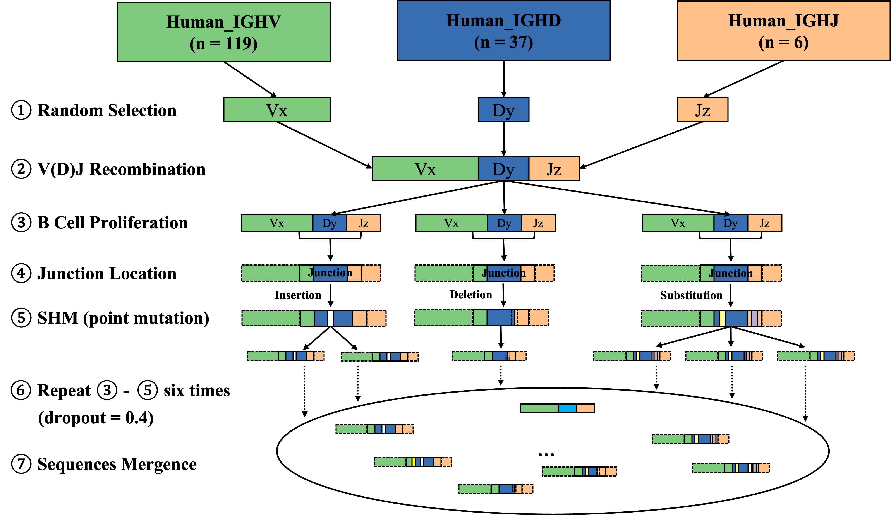

# fastBCR

### A heuristic method for fast BCR clonal family inference from large-scale AIRR-seq data

<!-- badges: start -->
<!-- badges: end -->

## Overview

The goal of fastBCR is to rapid inferencing B cell clonal families from
massive BCR heavy chain sequences. To facilitate the post-clustering
analysis, we also provide a series of functional modules in fastBCR,
including diversity analysis, V/J gene usage statistic, conserved motifs 
distribution, phylogenetic tree construction, affinity maturation analysis 
[somatic hypermutation (SHM) and class switch recombination (CSR)] and NAb 
query, which can be useful for BCR repertoire analysis and antibody discovery.

<div align=center>

</div>

### REFERENCE
Wang, K., Hu, X., and Zhang, J. (2023). **Fast clonal family inference from large-scale B cell repertoire sequencing data.** Cell Rep Methods, https://doi.org/10.1016/j.crmeth.2023.100601.

## Installation

Before installing fastBCR, you need to download the dependency packages
'proj4', 'msa', 'ggtree' and 'ggmsa' using Bioconductor. To install these packages, 
start R (version “4.1.0”) and enter:

``` r
if (!require("BiocManager", quietly = TRUE))
    install.packages("BiocManager")

BiocManager::install(c("proj4","msa","ggtree","ggmsa"))
```

Now you can install the development version of fastBCR like so:

``` r
if(!require(devtools)){
  install.packages("devtools")
}
devtools::install_github("ZhangLabTJU/fastBCR", ref = "development-version")
```

## Usage

### Example datasets

Ten real example AIRR Rearrangement datasets are included in
the fastBCR package in the 'example' folder. The datasets consist of BCR 
sequencing data from peripheral blood samples of five COVID-19 patients
(Galson et al., 2020) and five healthy donors (Ghraichy et al., 2020).
Inferencing clonal families requires the following columns to be present
in the table:

``` r
## "sequence_id"
## "v_call"
## "j_call"
## "junction_aa"
## "junction" (Optional. Needed for phylogenetic tree construction.)
## "c_call" (Optional. Needed for isotypes related analyis.)
```

### Example pipeline

fastBCR is an automatic BCR clonal family inference method, which also
incorporates multiple functional modules for downstream analyses.
fastBCR is composed of two parts: **Fast BCR clonal family inference**, and
**Downstream analysis**.

You can see our **protocol** (URL: ) for package usage and follow the **'pipeline.R'** 
in **'/example'** folder to run the pipeline example. 

### Clonal Family Simulation

In addition, fastBCR can be combined with annotation software (_e.g._ IgBlast) 
for B-cell **Clonal Family Simulation**. 

fastBCR can simulate the generation of B cell clonal families to evaluate the 
performance of different clonal family inference methods. Specifically, it 
begins by generating an ancestor cell through V(D)J random recombinant and 
simulated the process of antigen activation that led to multiple rounds of 
expansion, mutation in the junction region and elimination, ultimately 
resulting in the formation of a B cell clonal family. This process needs to be 
combined with sequence annotation software, and here we recommend using IgBlast.
(URL: https://changeo.readthedocs.io/en/stable/examples/igblast.html)

<div align=center>

</div>


``` r
germline2fas(100, filename = "Simulation/Germline.fasta")
# Annotation
germline_data = read.table('Simulation/Germline_igblast_db-pass_parse-select.tsv', header = T, sep = "\t")
CF2fas(germline_data, CF_n = 10, mut_ratio = 0.001, filename = 'Simulation/10_0.001.fasta')
# Annotation
```
