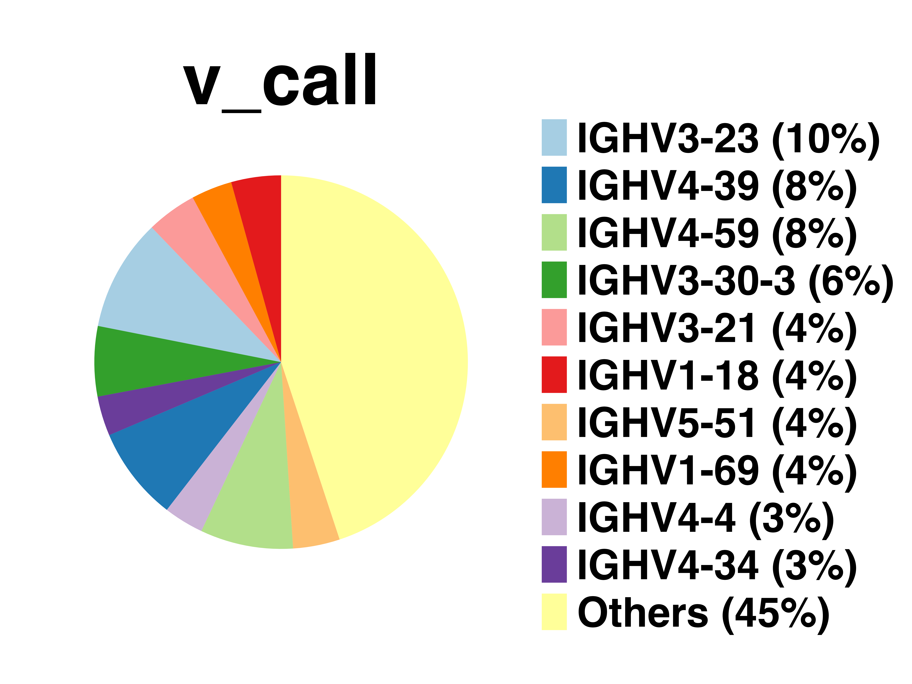
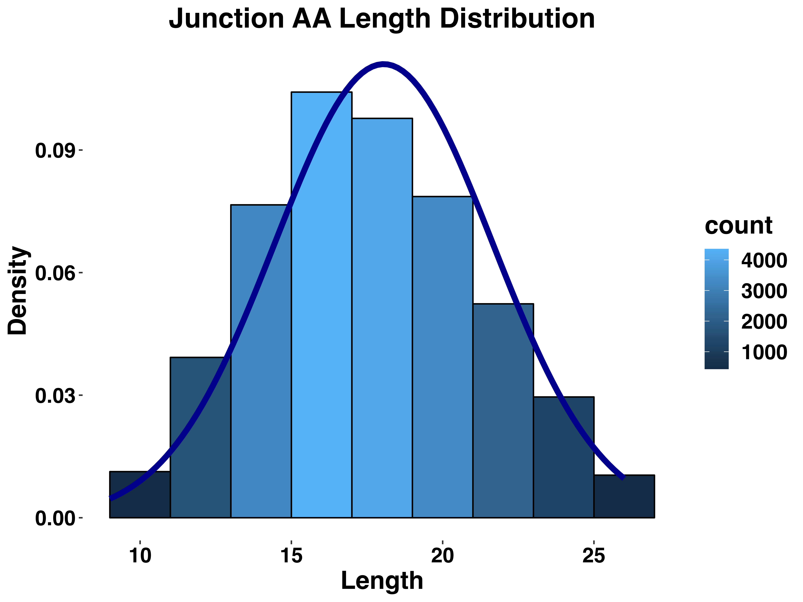
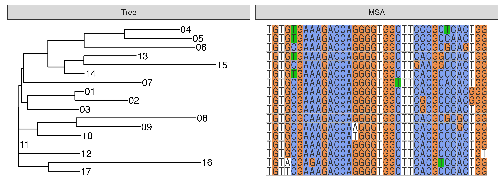
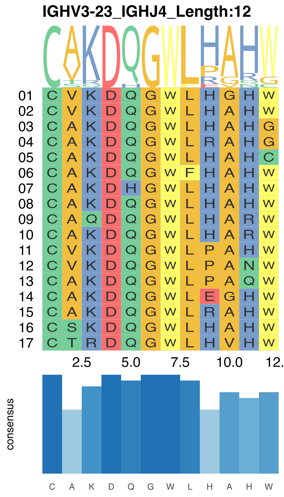
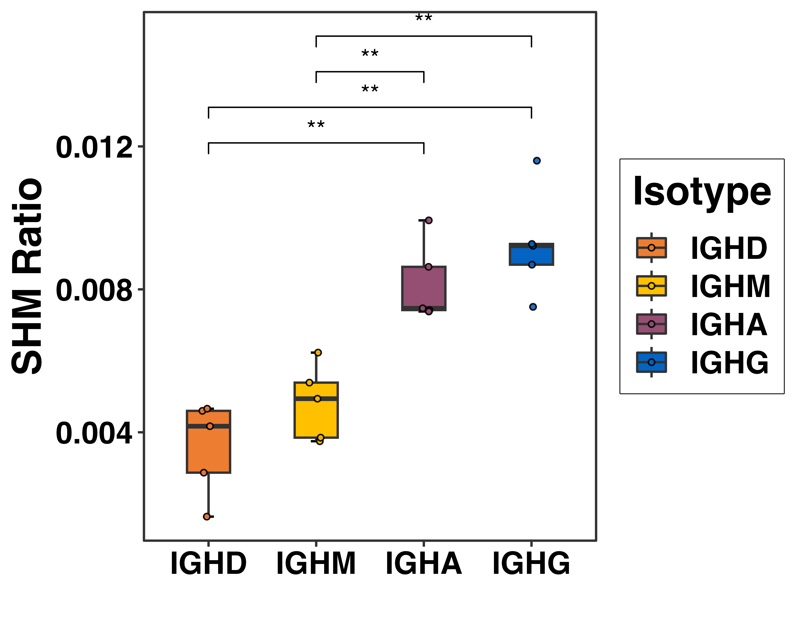
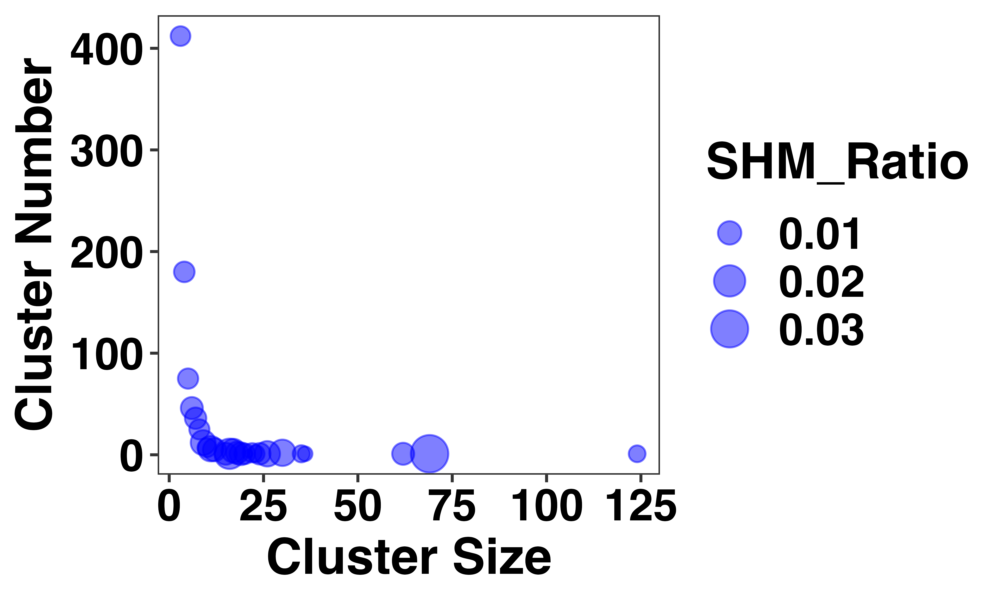
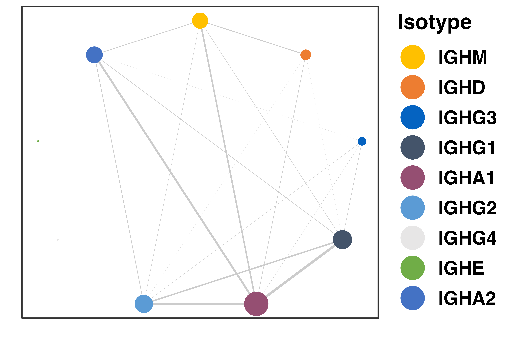
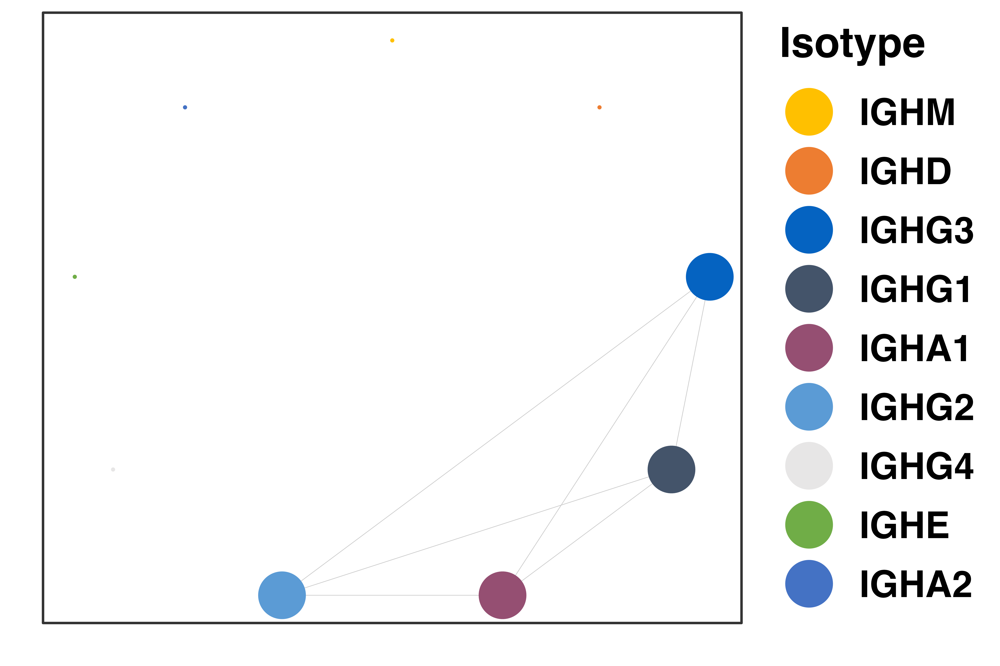

<!-- README.md is generated from README.Rmd. Please edit that file -->

# fastBCR

### a k-mer-based approach for fast inferencing clonal families from large-scale B cell repertoire sequencing data

<!-- badges: start -->
<!-- badges: end -->

The goal of fastBCR is to rapid inferencing B cell clonal families from
massive BCR heavy chain sequences. To facilitate the post-clustering
analysis, we also provide a series of functional modules in fastBCR,
including multiple sequence alignment (MSA), phylogenetic tree
construction, somatic hypermutation (SHM), and class switch analysis
(CSR), which can be useful for BCR repertoire analysis and antibody
discovery.

### REFERENCE

Kaixuan Wang, Jian Zhang\*. **fastBCR: a k-mer-based approach for fast
inferencing clonal families from large-scale B cell repertoire
sequencing data.** (manuscript in submission)

## Installation

Before installing fastBCR, you need to download the dependency packages
msa and ggmsa using Bioconductor. To install these packages, start R
(version “4.2”) and enter:

``` r
if (!require("BiocManager", quietly = TRUE))
    install.packages("BiocManager")

BiocManager::install("msa")
BiocManager::install("ggmsa")
```

Now you can install the development version of fastBCR like so:

``` r
# install.packages("devtools")
devtools::install_github("ZhangLabTJU/R-package/tree/main/fastBCR")
library(fastBCR)
```

## Sample dataset

A real example AIRR Rearrangement dataset (‘test_data’) is included in
the fastBCR package. The dataset consists of BCR sequencing data from
peripheral blood samples of a COVID-19 patient (Galson et al., 2020).
Inferencing clonal families requires the following columns to be present
in the table:

``` r
## "sequence_id"
## "v_call"
## "j_call"
## "junction_aa"
## "junction" (Optional. Needed for phylogenetic tree construction.)
## "c_call" (Optional. Needed for isotypes related analyis.)
```

## Example

fastBCR is an automatic BCR clonal family inference method, which also
incorporates multiple functional modules for downstream analyses.
fastBCR is composed of three parts: **Data Processing**, **BCR Clustering**, and
**Downstream Analysis**.


### Data Processing

Data Processing is the first step of fastBCR to process raw data. The
input of the function needs to meet the AIRR standard format. Only
productive sequences whose junction amino acid lengths between 9 and 26
are reserved. Sequences with the same ‘v_call’, ‘j_call’ and
‘junction_aa’ are considered identical and deduplicated.

``` r
library(fastBCR)
#> Loading required package: ggplot2
#> Loading required package: network
#> 
#> 'network' 1.18.1 (2023-01-24), part of the Statnet Project
#> * 'news(package="network")' for changes since last version
#> * 'citation("network")' for citation information
#> * 'https://statnet.org' for help, support, and other information
#> Loading required package: ggmsa
#> Registered S3 methods overwritten by 'ggalt':
#>   method                  from   
#>   grid.draw.absoluteGrob  ggplot2
#>   grobHeight.absoluteGrob ggplot2
#>   grobWidth.absoluteGrob  ggplot2
#>   grobX.absoluteGrob      ggplot2
#>   grobY.absoluteGrob      ggplot2
#> ggmsa v1.4.0  Document: http://yulab-smu.top/ggmsa/
#> 
#> If you use ggmsa in published research, please cite:
#> L Zhou, T Feng, S Xu, F Gao, TT Lam, Q Wang, T Wu, H Huang, L Zhan, L Li, Y Guan, Z Dai*, G Yu* ggmsa: a visual exploration tool for multiple sequence alignment and associated data. Briefings in Bioinformatics. DOI:10.1093/bib/bbac222
#> Loading required package: msa
#> Loading required package: Biostrings
#> Loading required package: BiocGenerics
#> 
#> Attaching package: 'BiocGenerics'
#> The following objects are masked from 'package:stats':
#> 
#>     IQR, mad, sd, var, xtabs
#> The following objects are masked from 'package:base':
#> 
#>     anyDuplicated, aperm, append, as.data.frame, basename, cbind,
#>     colnames, dirname, do.call, duplicated, eval, evalq, Filter, Find,
#>     get, grep, grepl, intersect, is.unsorted, lapply, Map, mapply,
#>     match, mget, order, paste, pmax, pmax.int, pmin, pmin.int,
#>     Position, rank, rbind, Reduce, rownames, sapply, setdiff, sort,
#>     table, tapply, union, unique, unsplit, which.max, which.min
#> Loading required package: S4Vectors
#> Loading required package: stats4
#> 
#> Attaching package: 'S4Vectors'
#> The following objects are masked from 'package:base':
#> 
#>     expand.grid, I, unname
#> Loading required package: IRanges
#> Loading required package: XVector
#> Loading required package: GenomeInfoDb
#> 
#> Attaching package: 'Biostrings'
#> The following object is masked from 'package:base':
#> 
#>     strsplit
data("test_data")
input <- data.pro(test_data)
```

### BCR Clustering

BCR Clustering is the core step of fastBCR to infer clonal families from
processed data. BCR Clustering consists of two steps, k-mer-based
pre-clustering and optimized clustering, to infer clonal families fast
and accurately.

``` r
library(fastBCR)
data("input")
bcr_clusters <- BCR.cluster(input) # A few parameters are optional. See the function introduction (?BCR.cluster) for details.
#> use default substitution matrix
#> use default substitution matrix
#> ...
#> use default substitution matrix
```

### Downstream Analysis

Downstream Analysis contains a variety of functional modules, such as
multiple sequence alignment (MSA), phylogenetic tree construction, and
SHM/CSR analysis. You can choose the plot function for downstream
analysis according to your needs.

#### Pieplot of V/J usage frequency

``` r
library(fastBCR)
data("input")
pie.freq(input, "v_call")
```


#### Histogram of junction length

``` r
library(fastBCR)
data("input")
junc.len(input, "AA")
```


#### Plot of phylogenetic tree and multiple sequences alignment (MSA)

``` r
library(fastBCR)
data(bcr_clusters)
msa.tree(bcr_clusters, 20)
#> use default substitution matrix
```



#### Visualization of junction_aa sequences within a cluster

``` r
library(fastBCR)
data(bcr_clusters)
msa.logo(bcr_clusters, 20)
#> use default substitution matrix
#> Coordinate system already present. Adding new coordinate system, which will
#> replace the existing one.
```



#### Boxplot of SHM ratios in four isotypes in different samples

``` r
library(fastBCR)
data("SHM_ratio_1")
data("SHM_ratio_2")
data("SHM_ratio_3")
data("SHM_ratio_4")
data("SHM_ratio_5")
df <- data.frame(
  Isotypes = factor(c("IGHD", "IGHM", "IGHA", "IGHG"),
    levels = c("IGHD", "IGHM", "IGHA", "IGHG")
  ),
  Sample1 = SHM_ratio_1,
  Sample2 = SHM_ratio_2,
  Sample3 = SHM_ratio_3,
  Sample4 = SHM_ratio_4,
  Sample5 = SHM_ratio_5
)
SHM.sample(df)
#> Using Isotypes as id variables
```



#### Scatter diagram of cluster size (x axis), cluster number (y axis) and SHM ratio (point size) of all clusters in a sample

``` r
library(fastBCR)
data("bcr_clusters")
SHM.cluster(bcr_clusters)
#> use default substitution matrix
#> use default substitution matrix
#> ...
#> use default substitution matrix
```



#### Network of CSR within a sample

``` r
library(fastBCR)
data("bcr_clusters")
CSR.sample(bcr_clusters)
#> Registered S3 method overwritten by 'GGally':
#>   method from   
#>   +.gg   ggplot2
```



#### Network of CSR within a cluster

``` r
library(fastBCR)
data("bcr_clusters")
CSR.cluster(bcr_clusters, 1)
```


